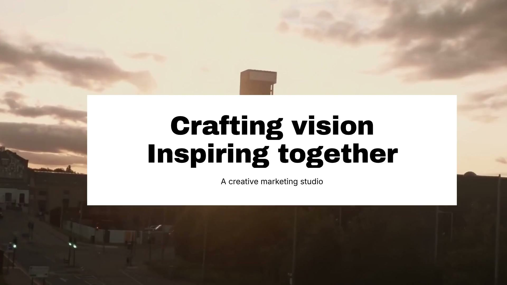
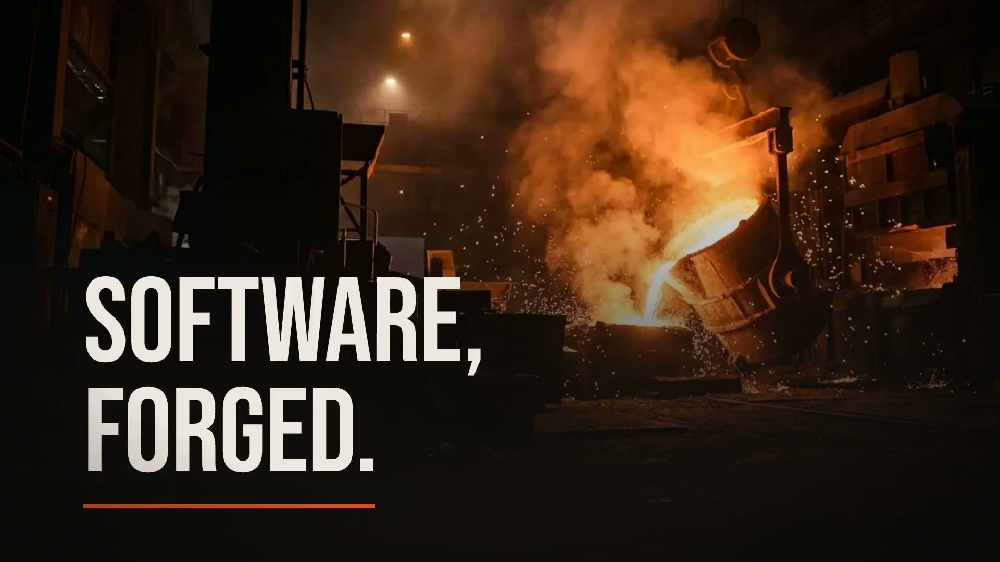

# Launch · Instant Cinema Video Engine for Modern Web Projects

<div align="center">

[](LICENSE)
[](https://nodejs.org)
[]()
[](https://ffmpeg.org)
[]()

**Generate unwatermarked 60fps cinema promo videos directly from your local codebase or live URL.**  
Extracts computed design tokens and true cubic-bezier motion physics in seconds.

[Explore Showcase](#-curated-showcase-productions) • [Quick Install](#-step-by-step-installation) • [CLI Commands](#-cli-command-reference) • [Architecture](#-engine-architecture)

</div>

---

## 🎬 Showcase Preview

| Production Master (16:9 4K / 60fps) | Live Gallery Showcase (16:9 4K / 60fps) |
| :---: | :---: |
|  |  |
| **Launch Engine Master** (`launch-engine.local`) | **Kalandula Gallery** (`kalandula.co.uk`) |

| Architectural Staging (16:9 4K / 60fps) | Bespoke Agency (16:9 4K / 60fps) |
| :---: | :---: |
|  |  |
| **Luminary House** (`luminaryhouse.co.uk`) | **The Forge** (`tf-ai.agency`) |

---

## ⚡ Key Capabilities

- **Automated Style & Palette Extraction**: Analyzes computed CSSOM and DOM style trees to extract exact colour palettes, typographic scales, font stacks, and layout geometry directly from your codebase in `< 400ms`.
- **True Cubic-Bezier Motion Choreography**: Samples transition curves, damping parameters, and scroll triggers directly from source styles for true-to-life UI animation and smooth scene handoffs.
- **Deterministic 60fps Master Rendering**: Frame-accurate Chromium renderer running locally with hardware GPU acceleration. Renders crystal-clear 1080p and 4K masters without dropped frames.
- **Multi-Aspect Ratio Output Matrix**: Render in 16:9 Landscape for web showcases, 9:16 Vertical for mobile reels and social feeds, or 1:1 Square in a single unified pipeline pass.
- **Frame-0 Baked Poster Engine**: Automatically identifies the settled hero frame and bakes it into frame 0 of the MP4 using FFmpeg for instant preview loading without black flash.
- **Dynamic Audio Beds & Voiceover Carving**: Automated track gain control, volume envelopes, and dynamic ducking to balance background music cleanly behind voice narration.

---

## 📦 Step-by-Step Installation

### 1. Prerequisites

Ensure you have the following installed on your machine:

| Dependency | Minimum Version | Verification Command |
| :--- | :--- | :--- |
| **Node.js** | `>= 20.0.0` (LTS recommended) | `node --version` |
| **FFmpeg** | `>= 6.0` (with H.264 & AAC support) | `ffmpeg -version` |
| **Git** | `>= 2.40.0` | `git --version` |

#### Installing Prerequisites:

- **macOS (Homebrew)**:
  ```bash
  brew install node ffmpeg git
  ```

- **Windows (winget / Chocolatey)**:
  ```powershell
  # Using winget
  winget install OpenJS.NodeJS.LTS Gyan.FFmpeg Git.Git

  # Or using Chocolatey
  choco install nodejs-lts ffmpeg git
  ```

- **Linux (Ubuntu / Debian)**:
  ```bash
  sudo apt update
  sudo apt install -y nodejs npm ffmpeg git
  ```

---

### 2. Clone & Install Dependencies

```bash
# Clone the repository
git clone https://github.com/SadikMohamud/Launch.git

# Navigate into the project folder
cd Launch

# Install dependencies
npm install
```

---

### 3. Run Development Server

```bash
# Start local development server with HMR and Lenis smooth scroll
npm run dev
```

Open [http://localhost:5173](http://localhost:5173) in your browser to view the interactive showcase and terminal runner.

---

### 4. Build Production Bundle

```bash
# Type check and build optimized static assets
npm run build

# Preview production build locally
npm run preview
```

The production assets will be built into the `dist/` directory, ready for immediate deployment to Vercel, Netlify, or Cloudflare Pages.

---

## 💻 CLI Command Reference

Launch includes a high-precision command runner to generate deliverables in seconds:

```bash
# 1. Generate a short promo video (15-25s) from your current local codebase
/launch

# 2. Capture and generate a 4K promo from a live website URL
/launch https://kalandula.co.uk

# 3. Generate a multi-scene long-form narrative showcase (30-90s)
/launch https://luminaryhouse.co.uk --long

# 4. Generate a 9:16 vertical reel for mobile and social channels
/launch --format vertical --tone cinematic

# 5. Extract design tokens and inspect CSSOM hierarchy without rendering
/launch --inspect --tokens-only
```

### Options & Flags

| Flag | Type | Default | Description |
| :--- | :--- | :--- | :--- |
| `--format` | `landscape` \| `vertical` \| `square` | `landscape` | Viewport aspect ratio (`16:9`, `9:16`, `1:1`) |
| `--fps` | `number` | `60` | Target rendering frame rate (`30`, `60`, `90`) |
| `--quality` | `1080p` \| `4k` | `1080p` | Master resolution scale |
| `--long` | `boolean` | `false` | Synthesizes an extended multi-scene narrative (30–90s) |
| `--tone` | `cinematic` \| `clean` \| `energetic` | `cinematic` | Color grade and camera motion pacing |
| `--ducking` | `boolean` | `true` | Automatically ducks background audio during narration |

---

## 🏗 Engine Architecture

The Launch rendering pipeline executes in three deterministic phases:

```
┌─────────────────────────┐     ┌───────────────────────────┐     ┌───────────────────────────┐
│   Inspect & Capture     │ ──> │   Choreograph & Compose   │ ──> │     Deliver & Publish     │
│                         │     │                           │     │                           │
│ • CSSOM style capture   │     │ • GSAP timeline synthesis │     │ • 60fps GPU render        │
│ • Typography hierarchy  │     │ • Cubic-bezier physics    │     │ • Frame-0 poster baking   │
│ • Palette harmonization │     │ • Multi-aspect reframing  │     │ • Zero watermark MP4      │
└─────────────────────────┘     └───────────────────────────┘     └───────────────────────────┘
```

1. **Inspect & Capture**: Automatically computes DOM trees, font families, color palettes, and container dimensions directly from source code or live HTTP endpoints.
2. **Choreograph & Compose**: Binds extracted design tokens into responsive scene blueprints with camera whip pans, Ken Burns focal zooms, and spring physics.
3. **Deliver & Publish**: Headless Chromium bakes frame-by-frame master video with FFmpeg hardware encoding and frame-0 settled poster integration.

---

## 🎨 Design System

Built on a Tier-1 brutalist/studio aesthetic inspired by leading European design studios:

- **Canvas Ground**: `#ffffff` (Pure White) & `#faf8f4` (Warm Surface)
- **Ink Typography**: `#0d0b0a` (Solid Near-Black) & `#201d1d` (High-Contrast Charcoal)
- **Vivid Accents**: `#ff0090` (Electric Pink), `#00ff66` (Neon Green), `#ffe600` (Acid Yellow)
- **Font Stacks**: `Hanken Grotesk Variable` (Display & Body) + `JetBrains Mono` (Code & Metrics)
- **Motion Physics**: Lenis Smooth Momentum Scroll + GSAP Spring Physics + Three.js Particle Fields

---

## 🚀 Deployment to Vercel

### Option A: One-Click Web Deployment
Import directly into Vercel via **[vercel.com/new](https://vercel.com/new)** and select `SadikMohamud/Launch`.

### Option B: Terminal Deployment
```bash
# Login to Vercel
npx vercel login

# Deploy directly to production
npx vercel --prod
```

---

## 📄 Licence

MIT License &middot; Created by **[Snurm](https://github.com/SadikMohamud)**
